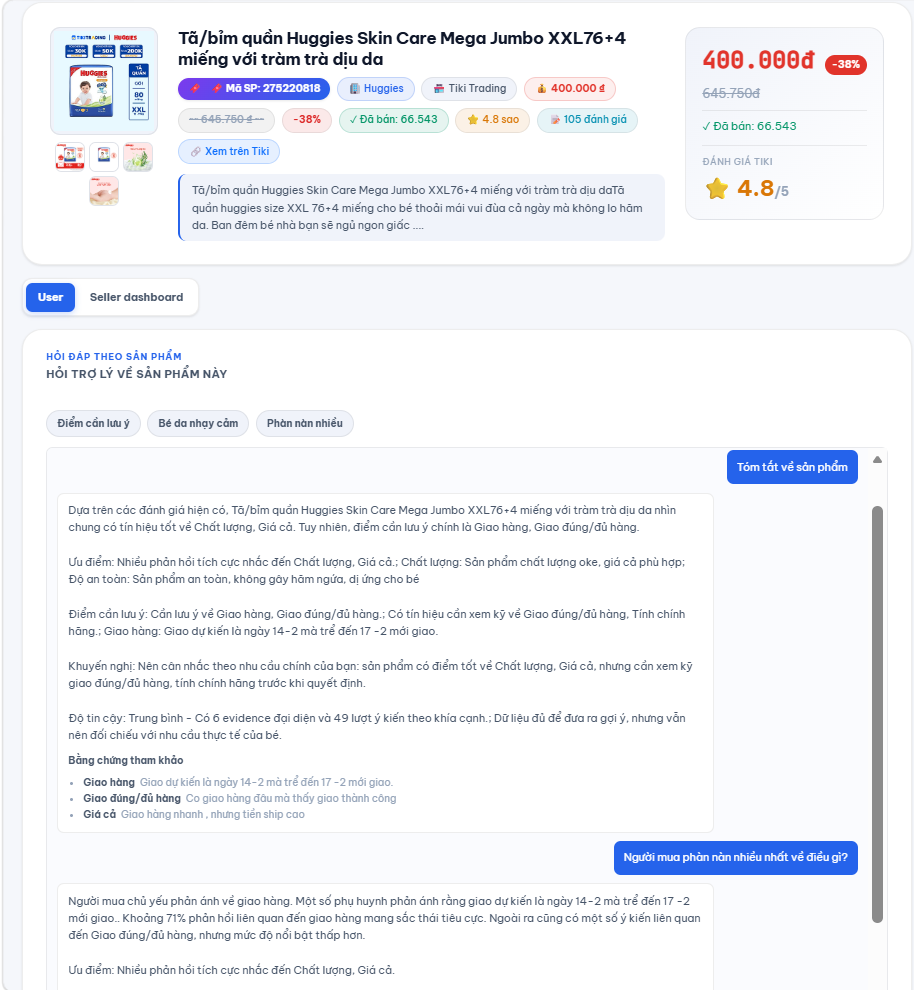
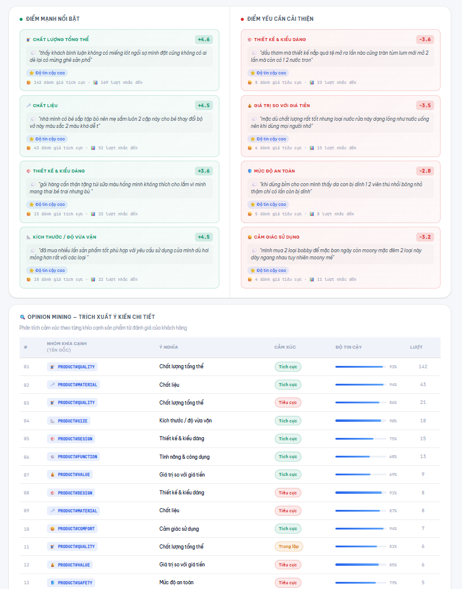
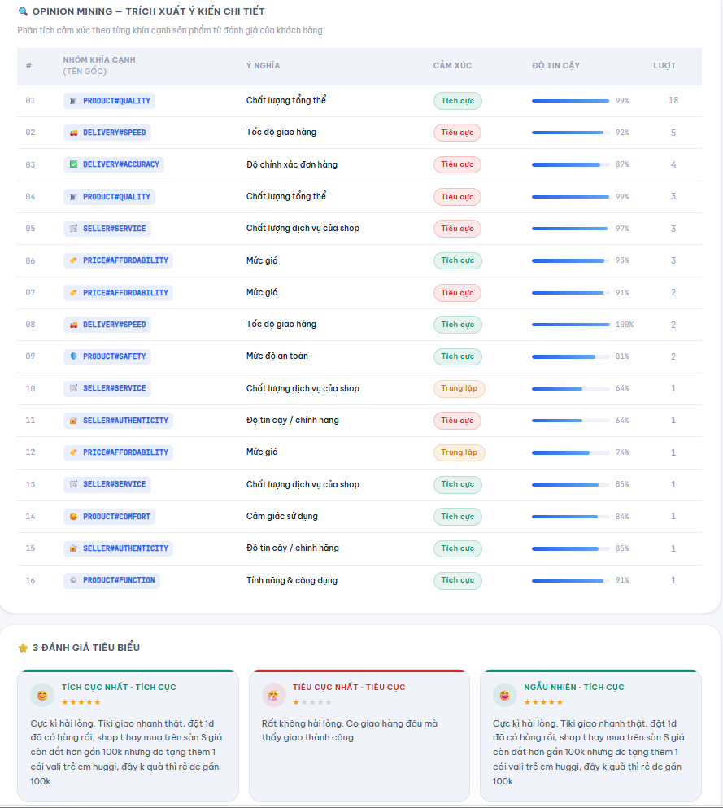

# TikiInsight - ABSA Dashboard & AI Shopping Assistant

TikiInsight is an NLP-based system for analyzing customer feedback on baby products from Tiki. The project combines Aspect-Based Sentiment Analysis (ABSA), product review analytics, and a RAG-powered AI shopping assistant to help users understand product strengths, weaknesses, risks, and purchase suitability from real customer reviews.


## Overview

Online shoppers often need to read many product reviews before deciding whether a baby product is worth buying. Reviews can be long, repetitive, mixed in sentiment, and difficult to summarize manually.

TikiInsight solves this problem by extracting product aspects from reviews, classifying sentiment for each aspect, summarizing review patterns into a dashboard, and answering product-related questions through an AI shopping assistant.

## Key Features

- Analyze Tiki product reviews from a product URL or product ID.
- Extract product aspects and classify sentiment using a fine-tuned PhoBERT ABSA model.
- Visualize product-level sentiment, aspect distribution, strengths, weaknesses, and review evidence.
- Detect risk signals from negative feedback groups.
- Provide an AI chatbot assistant for purchase advice, product fit, and review-based Q&A.
- Combine structured analytics with semantic retrieval through a hybrid RAG pipeline.

## Demo


| User Chatbot | Seller Dashboard | Opinion Mining |
|---|---|---|
|  |  |  |

## System Architecture

```text
Tiki product URL / product ID
    |
    v
Crawl product information and reviews
    |
    v
Preprocess reviews and split sentences
    |
    v
PhoBERT ABSA inference
    |
    v
PostgreSQL analytics + risk detection
    |
    v
Qdrant semantic retrieval
    |
    v
Hybrid RAG ranking and evidence compression
    |
    v
Dashboard + AI Shopping Assistant
```

## Core Technologies

| Area | Technologies |
|---|---|
| Backend | Python, FastAPI, Pydantic, SQLAlchemy |
| Frontend | HTML, CSS, JavaScript, Jinja2, Chart.js |
| NLP / Machine Learning | PhoBERT, PyTorch, Hugging Face Transformers, scikit-learn |
| RAG / LLM | RAG, hybrid retrieval, Qdrant, Gemini API, Groq API |
| Database / Cache | PostgreSQL, Redis |
| Data Processing | pandas, NumPy, regex, pyvi, underthesea |
| Infrastructure | Docker, Docker Compose |

## ABSA Models

The project includes several model approaches for research and comparison:

| Model | Role | Notes |
|---|---|---|
| Fine-tuned PhoBERT | Main ABSA model used by the web app | Aspect extraction and aspect-level sentiment classification |
| BiLSTM-CRF | Sequence labeling baseline | Used for model comparison |
| SVM + TF-IDF | Traditional machine learning baseline | Used for comparison with deep learning models |

Recorded experiment results:

| Model | Aspect Detection F1 | Aspect Polarity F1 |
|---|---:|---:|
| PhoBERT | 0.7975 | 0.8519 |
| BiLSTM-CRF | 0.7636 | 0.7951 |
| SVM + TF-IDF | 0.7735 | 0.8361 |

## Analyzed Aspects

The system maps internal aspect labels to user-friendly product insight categories, including:

- Product quality
- Material
- Size
- Safety
- Absorbency
- Comfort
- Durability
- Price
- Delivery
- Packaging
- Authenticity

## API Endpoints

| Method | Endpoint | Description |
|---|---|---|
| `GET` | `/` | Web dashboard |
| `POST` | `/api/analyze/start` | Start an asynchronous product analysis job |
| `GET` | `/api/analyze/progress/{job_id}` | Stream analysis progress with SSE |
| `POST` | `/api/analyze` | Analyze a product directly |
| `POST` | `/api/assistant/chat` | Ask review-based product questions |
| `POST` | `/api/assistant/purchase-advice` | Generate purchase advice |
| `POST` | `/api/assistant/product-fit` | Check whether a product fits user needs |
| `GET` | `/api/products/{product_id}/risk` | Get risk analysis for a product |
| `GET` | `/api/health` | Health check |

## Project Structure

```text
tiki/
|-- app/                  # FastAPI app, web UI, assistant services
|-- data/
|   |-- samples/          # Small sample data for GitHub/demo
|-- docs/
|   |-- images/           # README and demo screenshots
|-- models/
|   |-- README.md         # Model artifact instructions
|-- notebooks/            # Training and experiment notebooks
|-- src/                  # Training and research code
|-- Dockerfile
|-- docker-compose.yml
|-- requirements.txt
|-- .env.example
`-- README.md
```

Large datasets, cache files, model checkpoints, and experiment outputs are intentionally excluded from GitHub.

## Setup

### 1. Clone the repository

```powershell
git clone https://github.com/hoaihue04/tiki-nlp-absa.git
cd tiki-nlp-absa
```

### 2. Configure environment variables

Create a local `.env` file from the example:

```powershell
copy .env.example .env
```

Update the values in `.env`, especially the LLM provider and API key:

```text
LLM_PROVIDER=gemini
GEMINI_API_KEY=your_gemini_api_key
```

### 3. Add model artifacts

The web app requires the fine-tuned PhoBERT checkpoint:

```text
models/phobert/best_model.pt
```

Model files are not committed to GitHub because they are large artifacts. See `models/README.md` for the expected structure.

## Run With Docker Compose

Requirements:

- Docker Desktop
- `.env` file
- PhoBERT checkpoint at `models/phobert/best_model.pt`

Start all services:

```powershell
docker compose up -d --build
```

Open the app:

```text
http://127.0.0.1:8001
```

Health check:

```text
http://127.0.0.1:8001/api/health
```

Stop services:

```powershell
docker compose down
```

## Run Locally

Create and activate a virtual environment:

```powershell
python -m venv .venv
.\.venv\Scripts\python.exe -m pip install -r requirements.txt
```

Start the FastAPI server:

```powershell
.\.venv\Scripts\python.exe -m uvicorn app.app:app --host 127.0.0.1 --port 8001
```

Open:

```text
http://127.0.0.1:8001
```

For local execution, make sure PostgreSQL, Redis, and Qdrant are available and match the connection values in `.env`.

## GitHub Artifact Policy

The repository should contain source code, documentation, configuration examples, notebooks, and small sample data only.

Do not commit:

- `.env`
- raw, interim, processed, or training datasets
- cache folders
- model checkpoints such as `.pt`, `.pth`, `.pkl`, `.bin`
- experiment outputs and generated result files

## CV Summary

NLP-based Customer Feedback Analysis and AI Chatbot Assistant for Baby Products on Tiki. Built a FastAPI web application using PhoBERT, ABSA, PostgreSQL, Qdrant, and RAG to analyze product reviews, visualize customer insights, detect risk signals, and answer shopping-related questions from review evidence.
